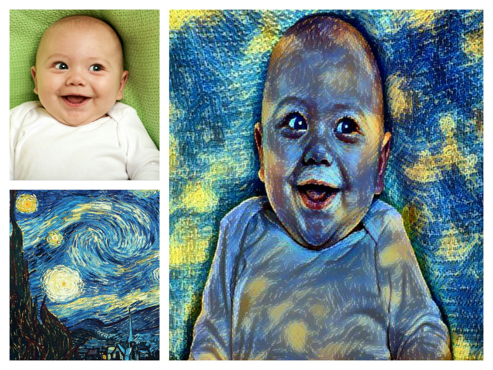

# Convnet Style-Transfer

-> This document is based on the famous research paper [Gatys et al., 2015](https://arxiv.org/abs/1508.06576)

Style transfer is the technique of recomposing images in the style of other images. These were mostly created using paper by Gatys, Ecker, and Bethge demonstrating a method for restyling images using convolutional neural networks.


## Requirements
You will need the following to run the above:
  * Python3.5
  * Tensorflow
  * Keras
  * Numpy

## How to run the code
For Ubuntu users:
```
$ python3 vgg16.py <content_image_path> <style_image_path>
```
## Results
Result based on 10 iterations:
<p align = 'center'>

</p>

## Observations
The following variations can be seen by changing some of the factors:
 * content-style weight ratio [see here](https://github.com/vishalsingh020997/Style-Transfer/blob/master/content-style_weight_variation.md)
 * extracting content features from different conv-net layers ratio [see here](https://github.com/vishalsingh020997/Style-Transfer/blob/master/content_layer.md)


## Attributions/Thanks
  * Some code was borrowed from Justin Johnson's [Fast Neural Style](https://github.com/jcjohnson/fast-neural-style)
